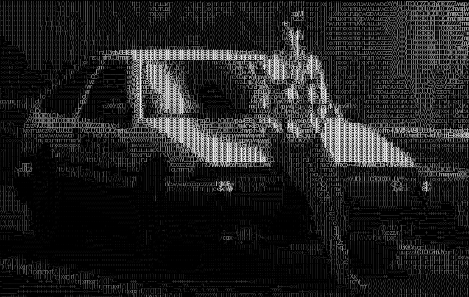

# Image2ASCII
This program converts an image into ASCII art in the terminal.

## How to get the program running on your machine
Clone the repository and navigate into the project directory. \
Install Python 3 using this command: \
`pip install python3` \
Then run the Python script using this command: \ 
`python3 convert.py` \

The program will ask you for:
1. Whether the ASCII art is produced should be greyscale or RGB
2. The absolute or relative path for the input image
3. How many pixels wide the image will appear in the terminal

The most recent image generated will be in the **savedImages** folder.

Here are some examples of images I created:

